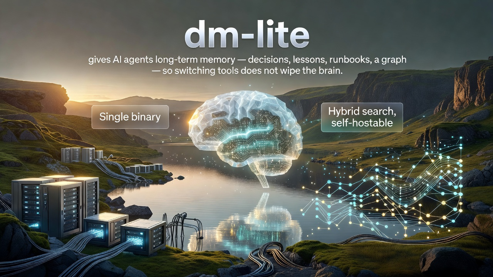

<p align="center">
  
</p>

# dm-lite

Memory for Hermes, Codex, Claude Code, OpenCode, Devin, Grok CLI, Claude Desktop, and any MCP agent. dm-lite is daimon-memory v2: one small typed memory engine in a single binary. Run `dmem serve` locally (a managed loopback daemon) or on a host, then point the CLI and agent hooks at it; local versus remote is just the URL. Hybrid recall (keyword and dense vector), bitemporal history, and multitenant storage (one database per tenant).

## Features

- One memory across your AI tools: the same recall and capture in Hermes, Codex, Claude Code, Devin, OpenCode, Grok CLI, and Claude Desktop, with the integration built in (one command per tool), not left for you to wire yourself. Switch tools, keep the same brain. Any MCP client can connect too, and receives the persona and protocols, not only the tools.
- Typed, curated memory: decisions, lessons, incidents, runbooks, conventions, reminders, and more, each a first-class kind.
- Hybrid recall: SQLite FTS5 keyword search fused with dense vectors (candle + bge-small by default, via zvec), ranked together.
- A graph over your memory: link records and mint domain entities (org, product, person, and more), so a recall pulls in a hit's neighbours; browse it offline with `dmem ui`.
- Bitemporal: two time axes, when a fact is true in the world and when you recorded it. Backdate a fact, end its validity, and recall both what was true at a past moment and what you knew at one. Nothing is overwritten.
- Client/server in one binary: run it locally, or host it on a VPS, homelab, or cloud box and point your machines at it. Local or remote is just a URL.
- Multitenant: one database per tenant, token-only IAM (root admin plus per-tenant tokens), built-in TLS (no reverse proxy).
- Per-agent identity on a shared memory: a token can carry an agent label, so each agent is served its own persona (namespace `agents/<agent>/`) while house rules, protocols, and the memory itself stay shared across the tenant; writes are attributed with an `author:<agent>` tag.
- Self-updating: `dmem upgrade` pulls the latest release in place.

## Quickstart

Grab the archive for your OS from the [latest release](https://github.com/wakbijok/dm-lite/releases). Each one holds `dmem` plus its native vector library; keep them together.

```bash
install -m755 dmem ~/.local/bin/dmem
cp libzvec_c_api.* ~/.local/bin/       # the lib must sit next to the binary
dmem setup                             # pick your agents, seed a first memory
```

Save and recall:

```bash
dmem remember "Devin is the Windsurf lineage"
dmem log_decision --title "Bet on zvec" --decision "use zvec as the vector store"
dmem recall "vector store decision"
```

Wire it into an agent (one command each, or `--all`):

```bash
dmem bootstrap --claude     # or --codex / --hermes / --devin / --opencode / --claude-desktop / --all
```

Out of the box this runs on one machine: the server and your client live together. To run the server on one host and connect clients from elsewhere, see the wiki.

## Requirements

Resource use is dominated by the **embedding model the server keeps resident**, not by the SQLite store. Live data is usually tens of megabytes on disk; process RSS is mostly model weights plus the vector index.

**Prebuilt release binaries** ship candle with default model `BAAI/bge-small-en-v1.5`. That is the supported out-of-the-box path. The same binary can load another 384-d Bert checkpoint via env (no recompile). You can also rebuild with a different embedder feature (`model2vec`, `fastembed`, or none for the hash placeholder) if you want a smaller footprint and accept the quality trade-off.

Figures below are **order-of-magnitude, once warm**, for a typical `dmem serve` on a small Linux VPS. OS, concurrent load, and corpus size move the needle; check `dmem doctor` and your process monitor on the real host.

| Setup | Typical process RSS | Languages / notes |
| --- | --- | --- |
| Prebuilt default: candle + `BAAI/bge-small-en-v1.5` | ~0.8-1.2 GiB | English-first. What the release ships. |
| candle + `intfloat/multilingual-e5-small` (env override) | ~1.2-1.5 GiB | Strong pick for **English + Malay (BM/MS)** and other languages. Set mean pooling and e5 role prefixes (see wiki). |
| candle + other 384-d Bert (env override) | similar to model size | Any HF Bert checkpoint with `tokenizer.json` + 384-d hidden size. Match pooling/prefixes to the model card. |
| Build with `model2vec` (e.g. potion-base-8M) | a few hundred MB | Much smaller; weaker semantic recall. |
| No real embedder (hash placeholder) | tens of MB | Keyword/FTS only. Not for production semantic recall. |
| Client-only against a remote `dmem serve` | negligible local model RAM | Embeddings run on the server. |

Disk: model cache is separate from the store (default bge weights ~130 MB on disk; multilingual checkpoints are often larger). After switching models, run `dmem reindex-embeddings` so old and new vectors share one space.

Details, offline cache, and env knobs: wiki [Embedding models](https://github.com/wakbijok/dm-lite/wiki/Embedding-models).

## Per-agent identity (shared memory, separate personas)

Several agents can share one tenant's memory while each receives only its own persona. Mint a token per agent (`dmem admin add <tenant> --agent izu`, or the env form `DM_TOKEN_<TENANT>__<AGENT>=secret` - double underscore separates tenant from agent). A token with an agent label is served the shared governance records (persona/protocol records outside the `agents/` namespace tree) plus that agent's own `agents/<agent>/...` persona - never another agent's - and its writes are stamped with an `author:<agent>` tag. Agent-less tokens keep the full legacy behaviour, so existing setups are unaffected until you opt in.

## Offline / air-gapped

Hybrid recall uses a small embedding model (prebuilt default: `BAAI/bge-small-en-v1.5`, about 130 MB on disk), downloaded from HuggingFace on first use. Check readiness before deploying to a sealed network:

```bash
dmem doctor          # active embedder, model, cache dir, whether it is already cached, CPU features
dmem doctor --json   # the same, machine-parseable
```

To run offline, pre-populate the model cache once on a connected machine, then carry it over (or point at a shared path):

```bash
# Pre-warm the cache (run once with network), then start dmem offline:
HF_HOME=/srv/hf-cache python -c \
  "from huggingface_hub import snapshot_download; snapshot_download('BAAI/bge-small-en-v1.5')"
HF_HOME=/srv/hf-cache dmem serve --addr 127.0.0.1:8088
```

`dmem` honours `HF_HOME` and `HUGGINGFACE_HUB_CACHE` (it uses the standard HuggingFace cache), and `dmem serve` logs the cache dir and model on startup. `dmem doctor` prints the exact directory it expects and whether the model is present, so you know up front if a first run needs network.

For CI and scripted ops, point any command at a server without editing the config: `dmem --endpoint https://memory.example.com recall "x"` (overrides `DM_ENDPOINT`; the token comes from `DM_TOKEN` or the config).

## Docs

Full documentation is in the [project wiki](https://github.com/wakbijok/dm-lite/wiki): install and first run, wiring each agent, run as a server, run as a client, embedding models and footprint, multitenant admin, persona and governance, migrating from v1, upgrading, and building from source.

License: [MIT](LICENSE). See also [CONTRIBUTING](CONTRIBUTING.md), [CODE_OF_CONDUCT](CODE_OF_CONDUCT.md), and [SECURITY](SECURITY.md).
